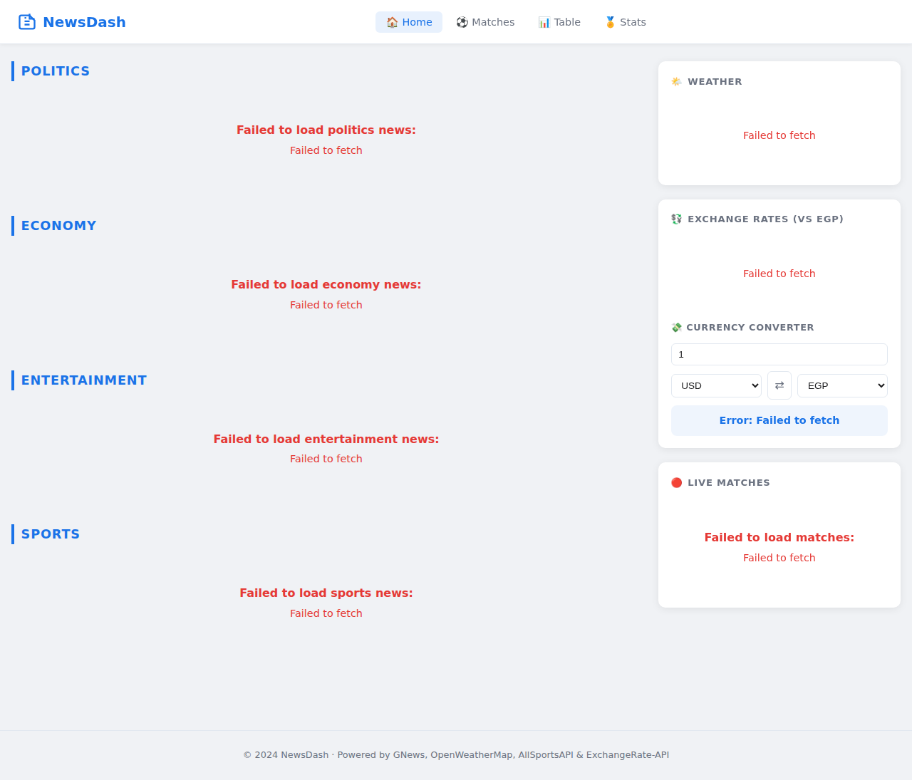
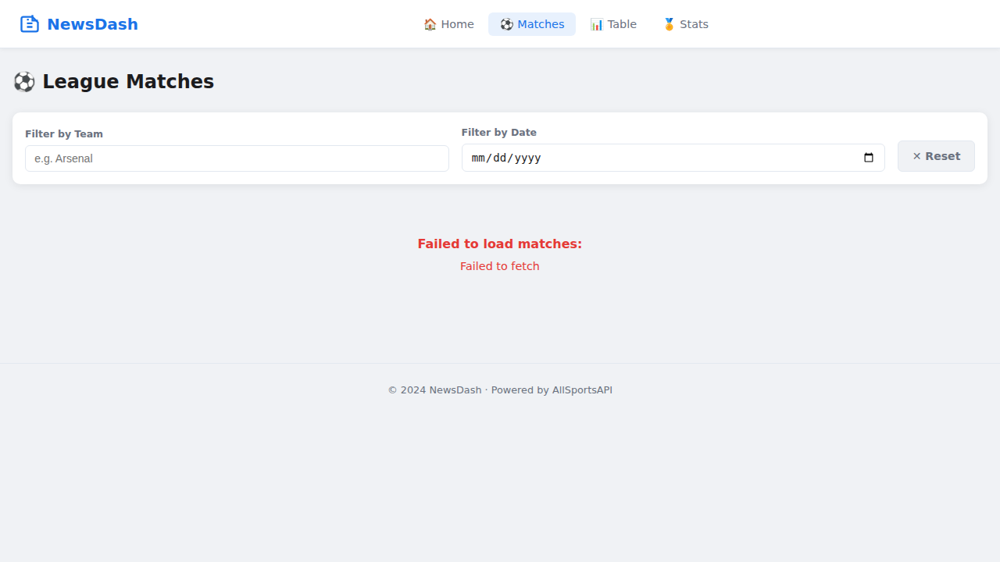
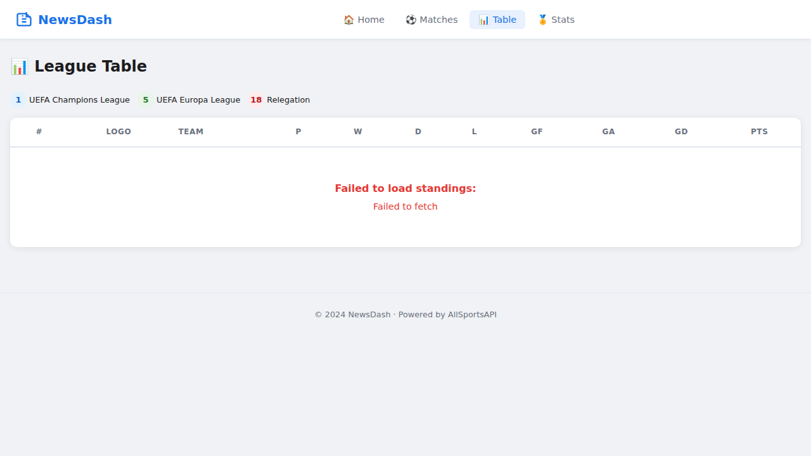
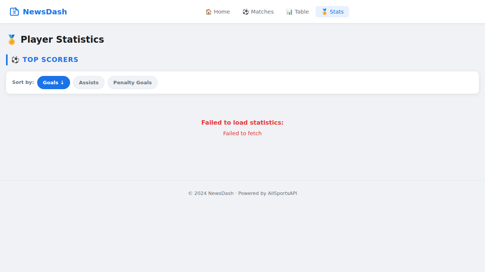

# News-Web

A modern, responsive multi-page News Dashboard built with plain HTML, CSS and Vanilla JavaScript. This application aggregates data from multiple APIs to provide real-time news, weather information, sports statistics, and currency exchange rates in a unified interface.



## Features

### Home Page
- **News Feed**: Browse news articles from 4 categories (Politics, Economy, Entertainment, Sports)
- **Weather Widget**: Real-time weather information based on your location
- **Exchange Rates**: Live currency exchange rates (USD and SAR vs EGP)
- **Currency Converter**: Interactive converter supporting 20+ popular currencies
- **Live Matches**: Display of up to 6 live football matches

### Matches Page
- View league fixtures with team logos and match information
- **Filter by Team**: Search matches by team name with debounced input
- **Filter by Date**: View matches for specific dates
- **Match Status**: Live, Finished, and Upcoming indicators with scores



### League Table/Standings
- Complete league standings with comprehensive statistics
- Visual indicators for:
  - Champions League positions (1-4)
  - Europa League positions (5-6)
  - Relegation zone (18+)
- Detailed stats: Played, Won, Drawn, Lost, Goals For/Against, Goal Difference, Points



### Player Statistics
- **Top Scorers**: View leading goal scorers with player photos
- Sort by Goals, Assists, or Penalty Goals
- Player cards showing team logos and detailed statistics



## Technology Stack

- **Frontend**: HTML5, CSS3, Vanilla JavaScript (ES6+)
- **Architecture**: Static web application with no build tools or frameworks
- **APIs**: Integration with 4 external data providers
- **Styling**: Custom CSS with CSS variables, Flexbox, and Grid layouts
- **Accessibility**: ARIA labels and semantic HTML throughout

## Pages

| Page | File | Description |
|------|------|-------------|
| Home | `index.html` | News feed (4 categories), weather, exchange rates, currency converter, live matches |
| Matches | `matches.html` | League fixtures with team-name and date filters |
| Table | `table.html` | League standings table with position indicators |
| Statistics | `stats.html` | Top scorers with sortable statistics |

## APIs Used

| API | Purpose | Free-tier limit |
|-----|---------|----------------|
| [GNews](https://gnews.io) | News articles | 100 req/day |
| [OpenWeatherMap](https://openweathermap.org) | Weather widget | 60 req/min |
| [AllSportsAPI](https://allsportsapi.com) | Football data (matches, standings, stats) | Free tier available |
| [ExchangeRate-API](https://exchangerate-api.com) | Currency exchange rates | 1,500 req/month |

## Quick Start

### Prerequisites
- A modern web browser (Chrome, Firefox, Safari, Edge)
- Python 3.x (for local server) or any other static file server
- API keys from the services listed above

### Installation

```bash
# 1. Clone the repository
git clone https://github.com/Moamen-R/News-Web.git
cd News-Web

# 2. Create your local API-key config (gitignored – never committed)
cp config.example.js config.js

# 3. Edit config.js and add your API keys
# Open config.js in your favorite text editor and replace the placeholder values
```

### Getting API Keys

1. **GNews API**:
   - Visit [https://gnews.io](https://gnews.io)
   - Sign up for a free account
   - Copy your API key to `config.js`

2. **OpenWeatherMap API**:
   - Visit [https://openweathermap.org/api](https://openweathermap.org/api)
   - Create a free account
   - Generate an API key
   - Add it to `config.js`

3. **AllSportsAPI**:
   - Visit [https://allsportsapi.com](https://allsportsapi.com)
   - Register for free access
   - Get your API key
   - Add it to `config.js`

4. **ExchangeRate-API**:
   - Visit [https://www.exchangerate-api.com](https://www.exchangerate-api.com)
   - Sign up for a free account
   - Copy your API key to `config.js`

### Running the Application

```bash
# Start a local web server (choose one):

# Option 1: Python 3
python3 -m http.server 8080

# Option 2: Python 2
python -m SimpleHTTPServer 8080

# Option 3: Node.js (if you have http-server installed)
npx http-server -p 8080

# Then open your browser to:
# http://localhost:8080
```

> **Note:** `config.js` is listed in `.gitignore`. It will never be committed.
> Only `config.example.js` (with placeholder values) is tracked by git.

## Project Structure

```
News-Web/
├── index.html              # Home page
├── matches.html            # League matches page
├── table.html              # League standings page
├── stats.html              # Player statistics page
├── config.example.js       # Configuration template
├── css/
│   └── style.css           # Main stylesheet
├── js/
│   ├── news.js             # News fetching and rendering
│   ├── weather.js          # Weather widget
│   ├── exchange.js         # Currency exchange rates & converter
│   ├── liveMatches.js      # Live matches widget (home page)
│   ├── matches.js          # League matches page logic
│   ├── table.js            # League standings logic
│   └── stats.js            # Player statistics logic
├── screenshots/            # Application screenshots
└── README.md               # This file
```

## Features in Detail

### Caching & Performance
- **News caching**: 30-minute localStorage cache to respect API rate limits
- **Exchange rate caching**: In-memory cache to minimize API calls
- **Lazy loading**: Images use lazy loading for better performance
- **Debounced filtering**: Smooth interactions with 500ms debounce on search inputs

### User Experience
- **Responsive design**: Mobile-first approach with hamburger menu
- **Sticky navigation**: Always accessible navigation bar
- **Loading states**: Animated spinners during data fetching
- **Error handling**: User-friendly error messages with context
- **Accessibility**: Screen reader friendly with ARIA labels

### Security
- **XSS Protection**: All user input and API data is escaped
- **Secure links**: External links open with `rel="noopener noreferrer"`
- **Config security**: API keys never committed to repository

## Configuration Options

The `config.js` file supports the following options:

```javascript
const CONFIG = {
  GNEWS_API_KEY: "your_gnews_api_key_here",
  OPENWEATHER_API_KEY: "your_openweather_api_key_here",
  ALLSPORTS_API_KEY: "your_allsports_api_key_here",
  EXCHANGE_API_KEY: "your_exchangerate_api_key_here",
  DEFAULT_LEAGUE_ID: 148,  // 148 = English Premier League
};
```

You can change `DEFAULT_LEAGUE_ID` to any league ID supported by AllSportsAPI.

## Browser Compatibility

This application works on all modern browsers:
- Chrome 90+
- Firefox 88+
- Safari 14+
- Edge 90+

## Troubleshooting

### APIs not loading
- Verify your API keys are correctly set in `config.js`
- Check browser console for specific error messages
- Ensure you haven't exceeded your API rate limits
- Check that your internet connection is stable

### Weather not showing
- Grant location permissions when prompted by the browser
- If denied, the app falls back to Cairo, Egypt coordinates

### Images not loading
- Some API endpoints may require HTTPS in production
- Check browser console for CORS errors

### 404 Errors
- Ensure you're running a web server (not opening files directly)
- Verify all file paths are correct relative to the server root

## Development

### Making Changes
1. Edit HTML, CSS, or JavaScript files
2. Refresh your browser to see changes
3. No build step required - it's vanilla JavaScript!

### Adding New Features
- Follow the existing code structure and naming conventions
- Add new JavaScript files in the `js/` directory
- Update this README with any new features or dependencies

## Contributing

Contributions are welcome! Please feel free to submit a Pull Request.

1. Fork the repository
2. Create your feature branch (`git checkout -b feature/AmazingFeature`)
3. Commit your changes (`git commit -m 'Add some AmazingFeature'`)
4. Push to the branch (`git push origin feature/AmazingFeature`)
5. Open a Pull Request

## License

This project is open source and available for educational purposes.

## Acknowledgments

- News data provided by [GNews](https://gnews.io)
- Weather data from [OpenWeatherMap](https://openweathermap.org)
- Sports data from [AllSportsAPI](https://allsportsapi.com)
- Currency data from [ExchangeRate-API](https://exchangerate-api.com)

---

**Note**: This is a demonstration project showing how to integrate multiple APIs into a cohesive dashboard application using vanilla JavaScript. API keys should be kept secure and never committed to version control.
